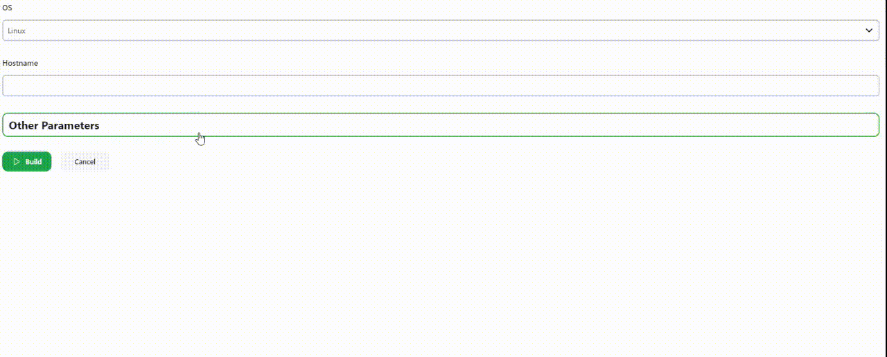
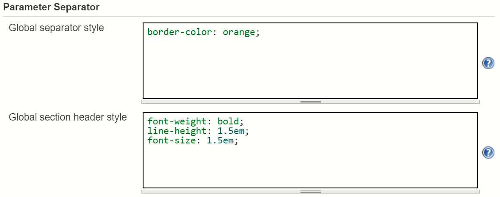

# Parameter Separator Toggle Plugin

## Introduction

This Jenkins CI plugin allows you to hide extra parameters on the job creation page, using integrated headers as buttons.

Each header created by the plugin acts as a button that can be clicked to hide or reveal a group of parameters. This is especially useful for tasks with a large number of parameters, where users can choose which parameters they need.

The plugin allows you to customize the styles of the headers and their behavior, making it a convenient tool for creating a more user-friendly and intuitive interface for managing job parameters in Jenkins CI.

### Example "Build with Parameters" page with separators



## Installing and configuring the plugin

Install this plugin from the Jenkins Update Center. Go to Manage Jenkins -> Plugin Manager -> Available tab. Search for
"Parameter Separator".

Configure default styling for your parameters in the Jenkins global configuration page. Go to Manage Jenkins -> Configure
System -> "Parameter Separator" section.



## Using in pipeline jobs

**Note:** It's recommended to provide an explicit name for each separator parameter, when using in pipeline.
Otherwise, it will be redefined under a new random name during each build, which can cause some minor issues.
For example, the "Job Configuration History" plugin will indicate that each has changed job configuration.

---

### Example usage in declarative pipeline

```groovy
pipeline {
	agent any
	parameters {
		separator(name: "building")
		choice(name: "java_vendor", choices: "Corretto")
		choice(name: "java_version", choices: "11")
		separator(name: "testing")
		choice(name: "browser", choices: "chrome")
		separator(name: "end")
	}
	stages {
		stage("Build") {
			steps {
				echo "Building using ${params.java_vendor}-${params.java_version}"
			}
		}
	}
}
```

---

### Example usage in scripted pipeline, with section headers

```groovy
properties([
	parameters([
		separator(name: "BUILD_ENVIRONMENT", sectionHeader: "Build Environment"),
		choice(name: "JAVA_VENDOR", choices: ["Coretto"]),
		choice(name: "JAVA_VERSION", choices: ["11"]),
		separator(name: "TEST_ENVIRONMENT", sectionHeader: "Test Environment"),
		choice(name: "OS", choices: ["Linux"]),
		choice(name: "BROWSER", choices: ["Chrome"])
	])
])
```

---

### Example usage in scripted pipeline, with advanced custom styling

```groovy
properties([
	parameters([
		separator(name: "BUILD_ENVIRONMENT", sectionHeader: "Build Environment",
			separatorStyle: "border-width: 0",
			sectionHeaderStyle: """
				background-color: #7ea6d3;
				text-align: center;
				padding: 4px;
				color: #343434;
				font-size: 22px;
				font-weight: normal;
				text-transform: uppercase;
				font-family: 'Orienta', sans-serif;
				letter-spacing: 1px;
				font-style: italic;
			"""
		),
		choice(name: "JAVA_VENDOR", choices: ["Coretto"]),
		choice(name: "JAVA_VERSION", choices: ["11"]),
		separator(name: "TEST_ENVIRONMENT", sectionHeader: "Test Environment",
			separatorStyle: "border-width: 0",
			sectionHeaderStyle: """
				background-color: #dbdb8e;
				text-align: center;
				padding: 4px;
				color: #343434;
				font-size: 22px;
				font-weight: normal;
				text-transform: uppercase;
				font-family: 'Orienta', sans-serif;
				letter-spacing: 1px;
				font-style: italic;
			"""
		),
		choice(name: "OS", choices: ["Linux"]),
		choice(name: "BROWSER", choices: ["Chrome"])
	])
])
```
